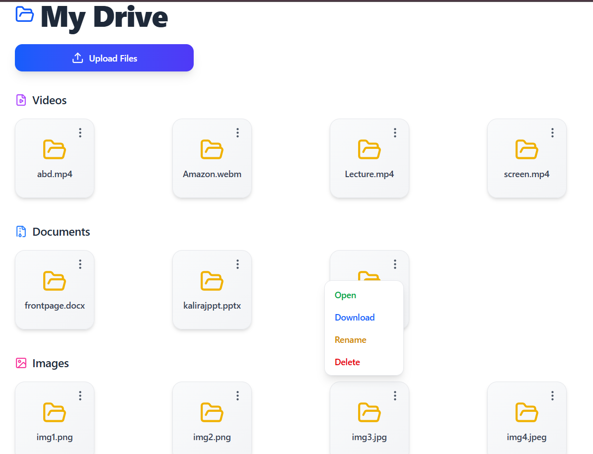

# 📂 Smart Data Storage Website

A web-based platform to **store, manage, and organize files** (documents, images, videos, etc.).  
This project contains both **frontend (React)** and **backend (Node.js)**.

---

## 🌐 Website Preview

  
*(Replace `preview.png` with your actual screenshot or image path)*

---

## ⚡ Tech Stack

- **Frontend**: React, Tailwind CSS, Fetch API  
- **Backend**: Node.js  
- **Database/Storage**: Local File Storage (can be extended)  
- **Other**: Git, CORS, HTTP Server  

---

## 📁 Folder Structure

```

MyDrive
┣ clientSide   # React frontend
┣ ServerSide   # Node.js backend

````

---

## 🚀 Installation & Setup

### 1️⃣ Clone the repository
```bash
git clone https://github.com/your-username/your-repo-name.git
cd your-repo-name
````

### 2️⃣ Backend Setup

```bash
cd ServerSide
npm install
node App.js
```

> Backend will run on `http://localhost:4000/`

### 3️⃣ Frontend Setup

```bash
cd clientSide
npm install
npm run dev
```

> Frontend will run on `http://localhost:5173/`

---

## ✨ Features

* 📂 Upload & store files
* 🖼️ Categorize files (Images, Videos, Documents, etc.)
* 🔍 Search and filter functionality
* 🎨 Responsive UI with Tailwind CSS
* 🔗 Frontend + Backend integration

---

## 🔧 Usage

1. Start the backend server
2. Start the frontend client
3. Open [http://localhost:3000](http://localhost:5173) in your browser
4. Upload, manage, and view files easily

---

## 📸 Screenshot

*(Add more UI screenshots here if needed)*

---


## 🤝 Contributing

Pull requests are welcome. For major changes, please open an issue first to discuss what you’d like to change.


```


